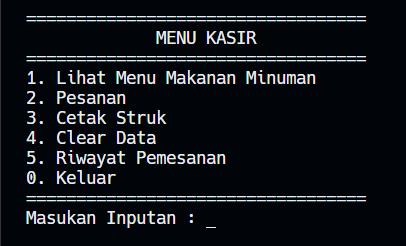

# 🍜 Proyek CLI Python - Kasir Berbasis CLI

## Deskripsi

Aplikasi kasir sederhana berbasis Command Line Interface (CLI) yang dibuat menggunakan Python. Program ini memungkinkan pengguna untuk mengelola pesanan makanan dan minuman, mencetak struk pembelian, serta menyimpan riwayat transaksi selama aplikasi berjalan.

## Fitur

* 📋 Melihat daftar menu makanan dan minuman
* ➕ Menambahkan pesanan pelanggan
* ➖ Menghapus pesanan
* 📄 Menampilkan daftar pesanan
* 🧾 Mencetak struk pembelian
* 🗑️ Menghapus data transaksi
* 📚 Menyimpan riwayat pemesanan
* 💰 Perhitungan total pembayaran dan diskon

## Versi Python
Python 3.14.3
#

## Konsep Pemrograman yang Digunakan
### Struktur Data
- List
- Nested List
- Dictionary
### Fungsi
- Function
### Percabangan
- if
- elif
- else
### Perulangan
- for
- while
### Modul
- Time
- Datetime


## Cara Menjalankan
```
.\main.py
```

## Menu Utama

```text
1. Lihat Menu Makanan Minuman
2. Pesanan
3. Cetak Struk
4. Clear Data
5. Riwayat Pemesanan
0. Keluar
```

## Screenshot

---
